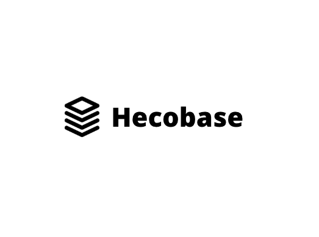
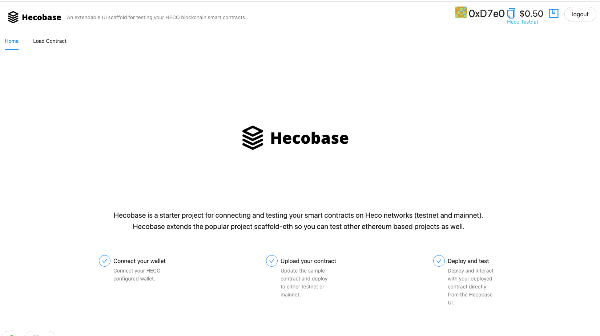

<p align='center'>
    
</p>

# Hecobase

Hecobase is a starter project for connecting and testing your smart contracts on Heco networks (testnet and mainnet). Hecobase extends a base open source project scaffold-eth so you can test other ethereum based projects as well.

Built for the <a href="https://hecochain-hackathon.devpost.com/rules" target="_blank">Toolkits on HECO</a> 2021 hecochain hackathon.

Bootstrap your projects and get deploying on the Heco main and test networks in no time. Use Hecobase to:

1. Create and connect wallets.
2. Connect to existing deployed Heco smart contract.
3. Call methods on that smart contract directly from the Hecobase UI..

## Deploying and linking a smart contract

- Update hardhat.config.js to your target network (Heco or other Eth based platform).
- To use deploy script, ensure you have a heco wallet with sufficient funds.
- Update TARGET_NETWORK to point to same network.
- Ensure there's nonzero heco balance. By default, `yarn deploy` will use the preset starter deployer account: 0xa1d3d032f9ec5a0fec2be20f3ff1e7e44141376c
- To check balance, use `yarn account`

Use the faucet to grant https://scan-testnet.hecochain.com/faucet

The contract `YourHecoContract.sol` should now be deployed. By default, the app will connect to the HECO testnet.

### Home page
<p align='center'>
    
</p>

## Quick Start

Prerequisites: [Node](https://nodejs.org/en/download/) plus [Yarn](https://classic.yarnpkg.com/en/docs/install/) and [Git](https://git-scm.com/downloads)

> clone/fork 🏗 hecobase:

```bash
git clone https://github.com/cbonoz/hecobase.git
```

> Start your 📱 frontend:

```bash
cd hecobase
yarn
yarn start
```

> in another terminal window, 🛰 deploy the sample `YourHecoContract` smart contract:

```bash
cd hecobase
yarn deploy
```

🔏 Edit your smart contract `YourHecoContract.sol` in `packages/hardhat/contracts`

📝 Edit your frontend `App.jsx` in `packages/react-app/src`

💼 Edit your deployment scripts in `packages/hardhat/deploy`

📱 Open http://localhost:3000 to see the app

## Useful links

### Mainnet:

- https://docs.hecochain.com/#/en-us/mainnet

### Testnet:

- https://docs.hecochain.com/#/en-us/testnet
- https://scan-testnet.hecochain.com/faucet

Heco contracts

- Sample deployed contract on testnet: https://testnet.hecoinfo.com/address/0x12fC865Bb0210B45177ad7018F548fd79099c1De
